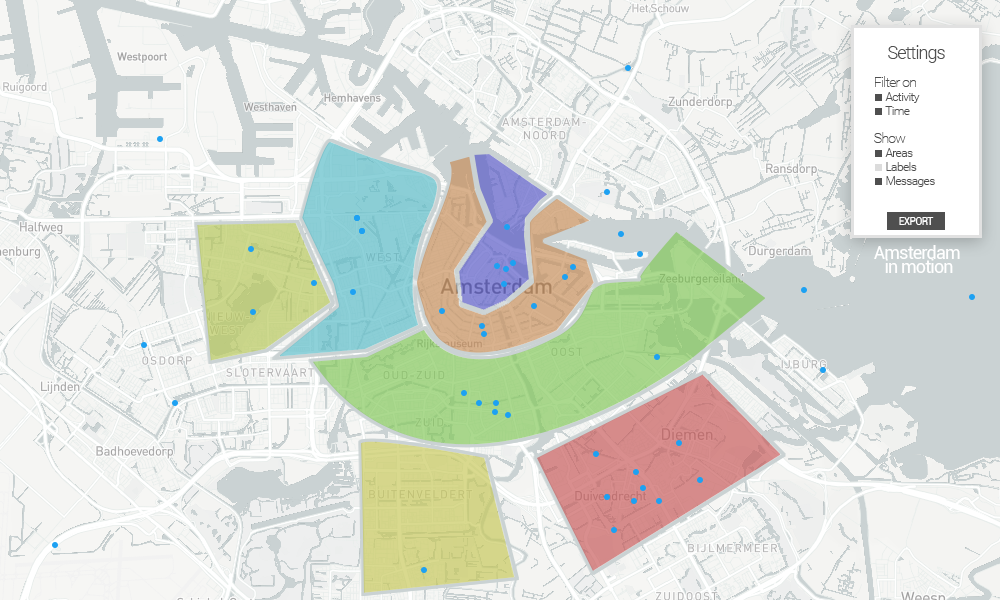

# Introduction
Social data is gathered in large quantities and available on the internet via mediums such as Facebook, Twitter and Instagram. These platforms are widely used by people to share information to the public. Individual tweets, status posts and photos may not be that useful for scientific studies, but when a multitude of these tweets, posts and photos are collected they can be analysed together. With the collected data characteristics can be extracted for different groups of individuals that for example share the same interest, like sport activities. The first challenge here is to collect data and retrieve the latent characteristics that can identify the persons interest in any kind of sport activity. The difficulty is in analysing, categorising and grouping data the right way to be able to extract and come to the right conclusions. Analysing data can give insights on how people are communicating, what they are are interested about, what motivates and drives them and just general information on what they are doing. 
Since data from the mentioned sources can contain geographic references, characteristics can possibly be identified and defined for certain areas. Another challenge here is spatial analysis and clustering of the collected data.

# Objective
The goal of Amsterdam in motion is to identify and characterise neighborhoods in Amsterdam based on sport activities, which requires the previously mentioned data collecting, categorisation, and spatial clustering. The identified neighbourhoods can then be visualised on a map to get an overview of where different sport activities are popular, on what days of the week and on what time of day. This can be useful for event organisers, shopkeepers, or people that want to know where to find companions in there sport activities. 

# Data Collection
To achieve this objective, data must be collected for the application. This data will be collected from two sources, which are social media platforms. 

The first source is [Twitter](https://twitter.com/). Twitter is a good choice to collect data from, since tweets contain mostly text about what people are doing. Along with that, a tweet can contain a geolocation of the user, who posted the tweet. Another good reason to use Twitter is that it has a very rich [API](https://dev.twitter.com/rest/public). To collect relevant data from Twitter, Twitter's streaming API will be used. The streaming API can be given a bounding box, to stream tweets which are send from the area of the bounding box. After this, every tweet will be checked if it has a geolocation and if so, this tweet will be collected. This is relevant for the application, since it might be possible to derive from the tweet what a user was doing at an exact location in Amsterdam.

The second source is [Strava](https://www.strava.com/). Strava is a good choice to collect data from, since it is a social media platform for athletes. This platform is used to keep track of sport activities like cycling and running, for this reason, data from Strava contains routes which are represented by geolocations. Just like Twitter, Strava has got a rich [API](https://strava.github.io/api/), from which the streaming API will be used. This API can also be given a bounding box, such that data from a specific area can be obtained, which in this case is Amsterdam.

With these two sources data which is relevant for the application, can be collected. Data from strava is relevant, because it contains data about athletes accompanied by their locations. Data from Twitter is relevant, since athletes might use Twitter to tell about their sport activities and if that tweet has a geolocation it can be derived where the athlete was conducting its sport. 
To derive this information after the collection, data must be analyzed, which will be discussed in the Section Methods.

# Methods
(Thom)

# Specifications & Execution Plan
In the previous sections the objective is presented and the way the data is collected and how this is processed so it can be used in the application. In this section the different features of the application will be described, and the different requirements to realise these features.

## MoSCoW
The MoSCoW method is a prioritisation technique used to reach a common understanding on the importance of the delivery of each requirement. The requirements are divided amongst four categories with each their one priority, as the name suggests. For this application the following requirements are identified and categorised as seen below.

### Must haves
- Data crawler on [Twitter](https://twitter.com/)
- Data crawler on [Strava](https://www.strava.com/)
- BM25 analytics with known taxonomies
- Visual representation of categorised data on [Mapbox](https://www.mapbox.com/)

### Should haves
- Dynamic selection on day of week to visualise data
- Dynamic selection on time of day to visualise data
- Neighborhood selection to represent several attributes regarding the neighborhood

### Could haves
- Real-time input of new taxonomies
- Use of Face++ to retrieve additional attributes to gain more insight into users
- Use of Genderize to retrieve additional attributes to gain more insight into users
- Dynamic selection on additional attributes
- Display multiple maps next to each other for easy comparison of different filters

### Won't haves
- Intensity (heat) map

First and foremost the application must be able to identify the characteristics of the data gathered from Twitter and Strava. The data, as explained in the Section Methods, is analysed by the BM25 algorithm to rank the relevance to a query. The main priority is to have finish these requirements first so a working prototype can be delivered.

Next the user experience to our platform will be enhanced by giving the user more control over the presentation of the data. The user will be able to view the data based on time of the day and day of week.

The visualisation can later be extended by more extensive analysis of the gathered data to enrich the user experience. With the use of tools such as Face++ and Genderize more attributes will be added to the application, which the user can use to further narrow down his target audience.

In the Table table-daan-timeline the timeline of the development of the application is given. First the highest priority requirements will of course be developed, and later on in the project the other requirements will be worked on. Throughout the whole project data will be gathered from the different sources.

|  Week 4 	|  Week 5 	| Week 6  	| Week 7  	| Week 8  	| Week 9	|
| ---		| ---		| ---		| ---		| ---		| ---		|
| Idea document| Visualising data on Mapbox | Connecting data stream to Mapbox | Finalising must-have requirements | Integration more attributes | Finalising application |
| | BM25 analytics | Taxonomy creation | Categorising data on different attributes | Dynamic selection filters | Presentation |

_Table table-daan-timeline: The timeline of the development of the application_

# Expected Outcomes
As mentioned earlier in the section objective, the goal of this application is to identify and characterise neighborhoods in Amsterdam. In figure mockup-ui a mockup of the user interface (UI) is shown, it will become visible how the UI could look.

  
   <i>Figure mockup-ui: Mockup of the User Interface</i>

The user is presented with a large map of Amsterdam. On this map blue dots are shown which are tweets or strava activities that are found to be relevant by the algorithm. Relevant posts are posts that fall into a sports activity based on the taxonomy of that sport. Around those posts the neighborhood boxes are drawn in different colors to quickly make clear how the neighborhoods of Amsterdam are divided based on sport activities. Because only relevant tweets are shown this can give an indication to the user how active an area is with regards to sports.

In the setting panel the user can customize what will be shown. This will contain a filter on the type of activity and a filter on when a tweet or activity has taken place. The setting to filter when activities were carried out will give insight in activities that only take place at a certain day of the week or even a certain time of the day. There are also show options which toggle areas or labels.

# Evaluation & Outlook
