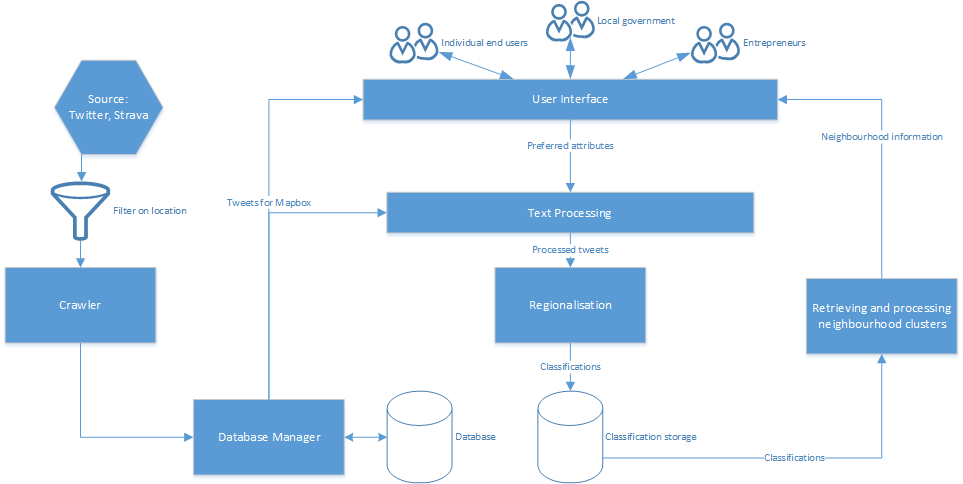

# Introduction

# Objective

# Data Collection

# Methods
This chapter specifies which methods will be used for the neighbourhood classification. The several steps that have to be taken to extract useful information out of the data are dispayed in a pipeline diagram, after which the steps are elaborated somewhat more.

### Overall system architecture
The following graph shows how input data (e.g. tweets) are processed into neighbourhood classifications.

   
  <i>Graphical representation of the proposed system architecture</i>   

These tweets can be used for both the processing and identification of neighbourhoods and direct display on the user interface. All relevant (sport-related) tweets will be displayed.

The tweets are processed to determine which topics are discussed. Relevant (i.e. matching with a sport related word list) tweets are used to classify neighbourhoods. The clusters are also used in the user interface.

### Crawler
The crawler uses the Twitter API and Strava data. After location based filtering all data is passed to the Database Manager which stores it for later usage.

### Database Manager
The storage is provided by a simple PostgreSQL database.

### Text processing
Messages are matched and indexed to a sports-related taxonomy to indicate whether the message gives information about a sports activity and which activity that could be, this is done using the [BM25 algorhitm or similar](http://scikit-learn.org/dev/modules/feature_extraction.html#text-feature-extraction).

### Regionalisation
After the contents of the message have been processed this information is sent to the regionalisation subsystem. This system clusters the messages over multple dimensions (spatial, time, sport). The spatial aspect of this is done by the maxp regionalisation algorithm, which is part of the [pysal library](http://pysal.readthedocs.io/en/latest/library/region/maxp.html). Clustering on the other properties is done by a more common clustering algorhitm like [k-means](http://scikit-learn.org/stable/modules/generated/sklearn.cluster.k_means.html#sklearn.cluster.k_means).

### User Interface
The tweets and regions are sent to the user interface. The different stakeholders can all retrieve their information need from it. [Mapbox](https://www.mapbox.com/) is used to display all this on a map. After the basic map of Amsterdam is loaded, the areas are plotted on it, including the dots which represent messages that are part of that cluster. A comprehensive interface provides methods for filtering the areas based on time and sport.

# Specifications & Execution Plan

# Expected Outcomes

# Evaluation & Outlook
